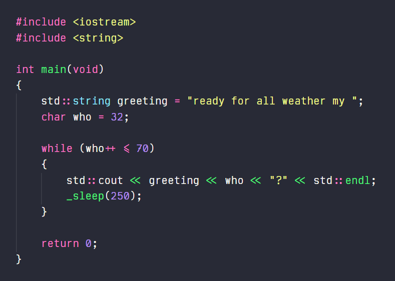

# Weather Mono

A clean, modern coding font with ligatures. Inspired by Fira Code and Inconsolata, among others.

Here it is in action:

Color theme in the screenshot is Dracula.

## Installation

#### Windows

Would recommend using the TrueType variant (`.ttf`), as I'm having some trouble getting the
OpenType version to hint properly with ClearType.

To install, just right-click on `WeatherMono*.ttf` and select 'Install for all users'.

#### Linux

Would recommend installing the OpenType variant (`.otf`) if you're running Linux -- looks a lot nicer.
Place the file in `~/.local/share/fonts/` or `/usr/share/fonts/` and run `fc-cache -fv`.

#### Mac

Haven't tested it on Mac yet: would appreciate your feedback.

## Roadmap

Currently in early development, watch this space for...

- Coding ligatures ✔️
- ASCII Extended charset
- Regular, bold & italic styles
